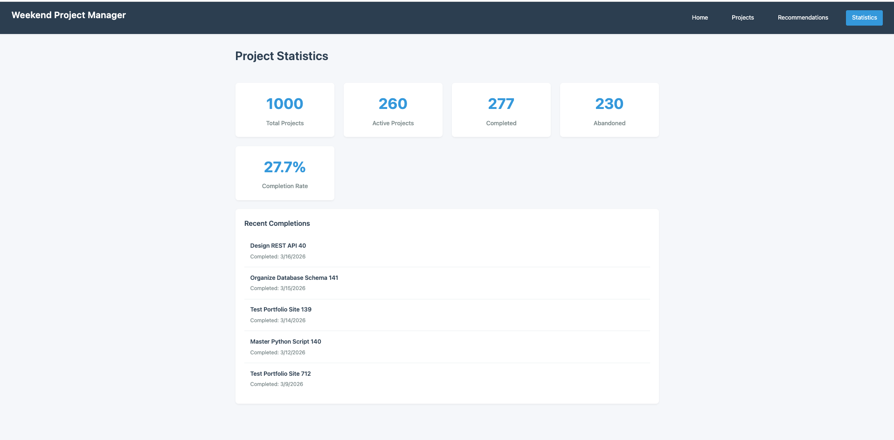

# Weekend Project Manager – Project 2

A full stack web application built with **Node.js, Express, MongoDB (Node Driver), and HTML5** that helps users organize personal projects and intelligently decide what to work on next.

---

## Author

**David Ahn and Alison Avery**

Align Master of Science in Computer Science
Northeastern University

---

## Course Reference

This project was completed as part of:

**Web Development (Spring 2026)**
Professor John Guerra

[https://johnguerra.co/classes/webDevelopment_online_spring_2026/](https://johnguerra.co/classes/webDevelopment_online_spring_2026/)

---

## Live Demo

* **Public Deployment:**
  
  [https://weekendprojectmanager.vercel.app/](https://weekendprojectmanager.vercel.app/)

* **GitHub Repository:**

  [https://github.com/Project-2-Node-Express-Mongo-HTML5/Project-2_backend_Node_Express_Database_Mongo_Frontend_HTML5/tree/Draft_Branch](https://github.com/Project-2-Node-Express-Mongo-HTML5/Project-2_backend_Node_Express_Database_Mongo_Frontend_HTML5)

---

## Design Documentation

**Design Document:**

[DesignDocument.md](./DesignDocument.md)

---

## Demo Video

**Application Walkthrough:**

[https://project-2-backend-node-express-data.vercel.app/home.html](https://www.youtube.com/watch?v=QX9rpQr-QlU)

**3‑Minute Demo Video (Google Slides Recording):**

[https://project-2-backend-node-express-data.vercel.app/home.html](https://www.youtube.com/watch?v=QX9rpQr-QlU)

**Google Slides Presentation:**

https://docs.google.com/presentation/d/1F0J_cKHwfxo14nCvGzCqhG8exH2VySDgbk2cNHoE0jE/edit?usp=sharing

---

## Screenshots

### Main Interface


### Projects Section


### Decision Profile Creation


### Recommendation Result


### Statistics Result



---

## System Architecture Wireframe

The diagram below illustrates the 3-tier architecture and separation between:

* Client (HTML5 + Vanilla JS ES Modules)
* Server (Node + Express REST API)
* Database (MongoDB using Official Node Driver)
* Project Lifecycle Engine
* Decision Context Engine

The Express server serves static frontend assets and exposes REST endpoints under `/projects`, `/profiles`, and `/recommend`.

The `/recommend` endpoint reads from both collections and computes ranked results dynamically without persisting derived scores.

---

## Features

### Projects Collection (Full CRUD)

* `GET /projects`
* `POST /projects`
* `PATCH /projects/:id`
* `DELETE /projects/:id`

Projects include lifecycle states (`active`, `completed`, `archived`, `abandoned`) and timestamps for long-term tracking and analytics.

Each project stores:

* Estimated time (minutes)
* Effort level (`low`, `medium`, `high`)
* Intrinsic priority (1–5)
* Optional seasonal constraint

---

### Profiles Collection (Full CRUD)

* `GET /profiles`
* `POST /profiles`
* `PATCH /profiles/:id`
* `DELETE /profiles/:id`

Profiles define reusable decision contexts including:

* Available time (minutes)
* Energy level (`low`, `medium`, `high`)
* Optional seasonal preference

Profiles are independent from projects and do not store computed results.

---

### Recommendation Engine

* `GET /recommend?profileId=<id>`

> `/recommend` is a read-only endpoint that ranks projects based on profile constraints. It does not store derived data.

The recommendation logic implemented in the Draft Branch:

1. Retrieves the selected profile using `profileId`
2. Fetches all active projects
3. Filters out projects that exceed available time
4. Scores projects based on:

   * Time proximity to available time
   * Energy alignment
   * Seasonal match
   * Intrinsic priority weighting
5. Sorts projects by weighted score
6. Returns the top 3 ranked results
7. Includes a transparent explanation breakdown for each project

All scoring is computed at request time. No recommendation scores are stored in MongoDB.

---

## Example API Usage

### Example Request

```
GET /recommend?profileId=65f8ab1234abcde567890123
```

### Example Response (Simplified)

```json
[
  {
    "_id": "65f8ac...",
    "title": "Learn Docker",
    "score": 8.7,
    "explanation": [
      "Matches available time",
      "Energy level aligned",
      "High intrinsic priority"
    ]
  }
]
```
> `/recommend` is a read only endpoint that ranks projects based on profile constraints. It does not store derived data.

---

## Technologies Used

### Backend

* Node.js
* Express.js
* MongoDB (Official Node Driver)
* Modular route structure (`/routes/projects.js`, `/routes/profiles.js`, `/routes/recommend.js`)

### Frontend

* HTML5
* Modular CSS
* Bootstrap
* Vanilla JavaScript (ES6 Modules)
* Fetch API for REST communication
* Dynamic DOM updates without page reload

### Tooling

* Docker (MongoDB container)
* ESLint
* Prettier

---

## Instructions to Build & Run Locally

###  Clone the Repository

```bash
git clone https://github.com/Project-2-Node-Express-Mongo-HTML5/Project-2_backend_Node_Express_Database_Mongo_Frontend_HTML5.git
cd Project-2_backend_Node_Express_Database_Mongo_Frontend_HTML5
```

---

### Install Dependencies

```bash
npm install
```

---

###  Start MongoDB (Docker)

```bash
docker run --name mongodb -p 27017:27017 -d mongodb/mongodb-community-server:latest
```

If MongoDB is already running, skip this step.

Connection string used by the server:

```
mongodb://localhost:27017
```

---

### Start the Server

```bash
npm start
```

The Express server:

* Connects to MongoDB using the official Node driver
* Serves static frontend files
* Registers route modules for `/projects`, `/profiles`, and `/recommend`

Open the application in your browser:

```
http://localhost:3000
```

---

## Environment Configuration

The server can be configured using environment variables (recommended for deployment):

* `PORT` – Server port (default: 3000)
* `MONGO_URI` – MongoDB connection string

Example `.env` file:

```
PORT=3000
MONGO_URI=mongodb://localhost:27017
```

---

## Project Structure

```text
/docs            → Design assets and screenshots
/public          → Static frontend (HTML, CSS, JS)
  index.html     → Main UI (projects + profiles + recommend)
  /css           → Modular stylesheets
  /js            → Frontend logic (projects.js, profiles.js, recommend.js)

/server          → Backend (Node + Express + MongoDB)
  server.js      → Express server entry point
  /config        → Database connection (database.js)
  /routes        → Express route modules (projects, profiles, recommend)
  /controllers   → Request handlers and business logic
  /seed.js       → Optional data seeding script

DesignDocument.md → System design write-up
README.md         → Project overview and setup instructions
package.json      → Dependencies and npm scripts
```

---

## Architectural Highlights

* Clear separation between Project Lifecycle and Decision Context engines
* Independent MongoDB collections (`projects`, `profiles`)
* Pure computation endpoint for recommendations
* No duplication of derived scores in the database
* Dynamic frontend updates without requiring page refresh
* Modular route organization for maintainability and scalability
* Dockerized local database for reproducible development
* Environment variable based configuration for deployment readiness

---

## Future Improvements

* Authentication and user accounts
* Persistent analytics dashboard (completion rate, trends)
* Advanced weighting configuration for scoring algorithm
* Deployment automation with CI/CD
* Unit and integration test coverage expansion
* UI/UX refinement and accessibility improvements

---

## License

MIT License

