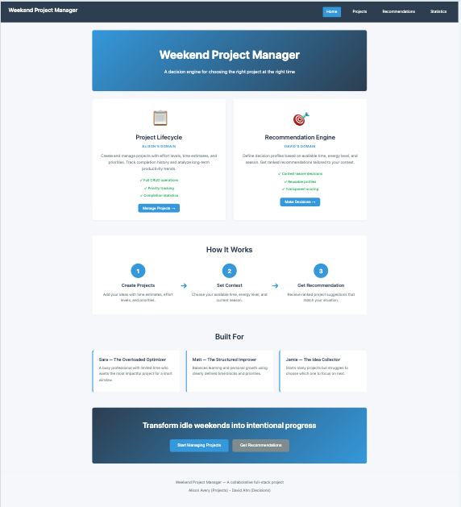
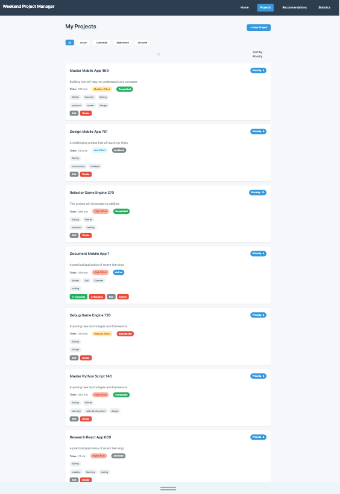
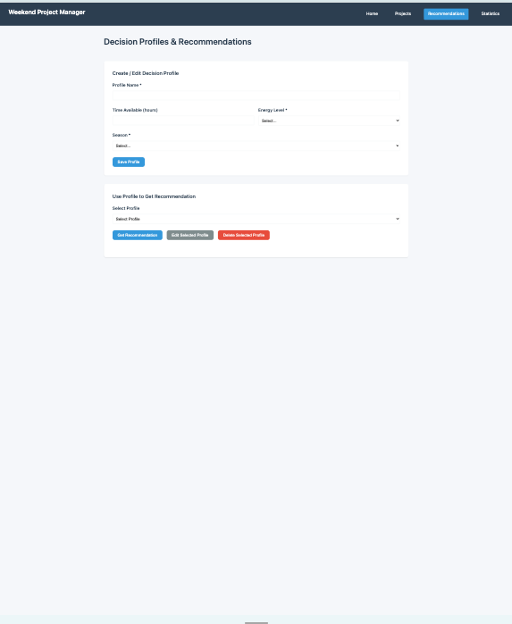
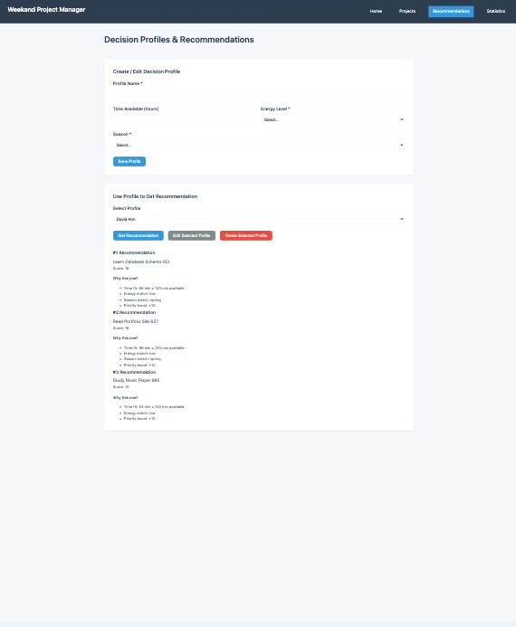
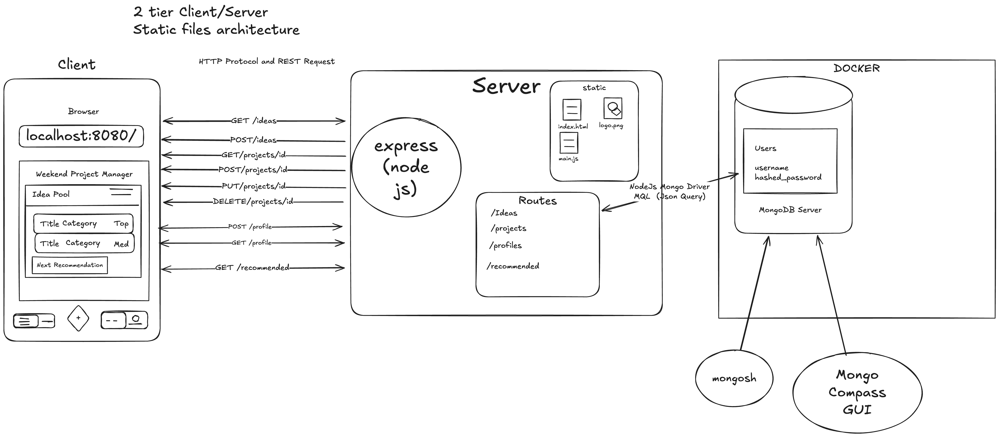

# Weekend Project Manager – Project 2

A full stack web application built with **Node.js, Express, MongoDB (Node Driver), and HTML5** that helps users organize personal projects and intelligently decide what to work on next.

---

## Author

**David Ahn and Nicole Avery**

Align Master of Science in Computer Science
Northeastern University

---

## Course Reference

This project was completed as part of:

**Web Development (Spring 2026)**

[https://johnguerra.co/classes/webDevelopment_online_spring_2026/](https://johnguerra.co/classes/webDevelopment_online_spring_2026/)

---

## Live Demo

* **Public Deployment:**
* 
  *(Add deployed Render / Railway / Vercel link here once available)*

* **GitHub Repository:**
  
  [https://github.com/Project-2-Node-Express-Mongo-HTML5/Project-2_backend_Node_Express_Database_Mongo_Frontend_HTML5](https://github.com/Project-2-Node-Express-Mongo-HTML5/Project-2_backend_Node_Express_Database_Mongo_Frontend_HTML5)

---

## Design Documentation

**Design Document:**
[DesignDocument.md](./DesignDocument.md)

---

## Demo Video

**Application Walkthrough:**
*( YouTube link )*

**3‑Minute Demo Video (Google Slides Recording):**
*( demo link)*

**Google Slides Presentation:**
*( slides link )*

---

## Screenshots

### Main Interface



### Projects Section



### Decision Profile Creation



### Recommendation Result



---

### System Architecture Wireframe

The diagram below illustrates the 3 tier architecture and separation between:

* Client (HTML5 + Vanilla JS)
* Server (Node + Express)
* Database (MongoDB)
* Project Lifecycle Engine
* Decision Context Engine



---

## Features

### Projects Collection (Full CRUD)

* `GET /projects`
* `POST /projects`
* `PATCH /projects/:id`
* `DELETE /projects/:id`

### Profiles Collection (Full CRUD)

* `GET /profiles`
* `POST /profiles`
* `PATCH /profiles/:id`
* `DELETE /profiles/:id`

### Recommendation Engine

* `GET /recommend?profileId=<id>`

> `/recommend` is a read‑only computation endpoint that dynamically ranks projects based on profile constraints. It does not store derived data.

---

## Technologies Used

### Backend

* Node.js
* Express.js
* MongoDB (Official Node Driver)

### Frontend

* HTML5
* Modular CSS
* Bootstrap
* Vanilla JavaScript (ES6 Modules)
* Fetch API for REST communication

### Tooling

* Docker (MongoDB container)
* ESLint
* Prettier

---

## Instructions to Build & Run Locally

### 1️ Clone the Repository

```bash
git clone https://github.com/Project-2-Node-Express-Mongo-HTML5/Project-2_backend_Node_Express_Database_Mongo_Frontend_HTML5.git
cd Project-2_backend_Node_Express_Database_Mongo_Frontend_HTML5
```

---

### 2️ Install Dependencies

```bash
npm install
```

---

### Start MongoDB (Docker)

```bash
docker run --name mongodb -p 27017:27017 -d mongodb/mongodb-community-server:latest
```

If MongoDB is already running, skip this step.

---

###  Start the Server

```bash
npm start
```

Open the application in your browser:

```text
http://localhost:8080
```

---

## Project Structure

```text
/frontend        → Static HTML, CSS, JS
/routes          → Express route modules
/db              → Database connector module
/data            → Sample data (if applicable)
backend.js       → Express server entry point
```

---

## License

MIT License
